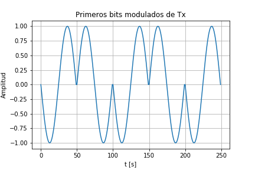
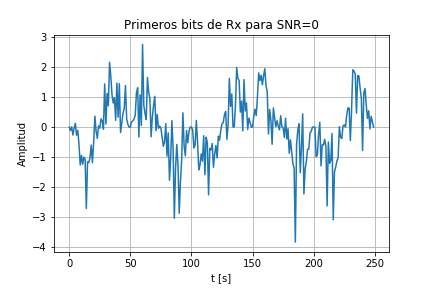
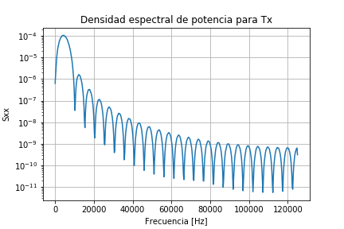
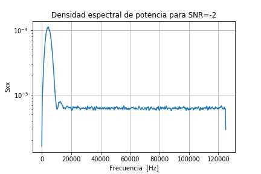
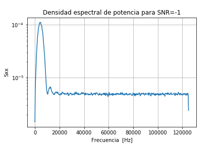
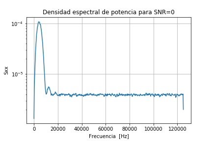
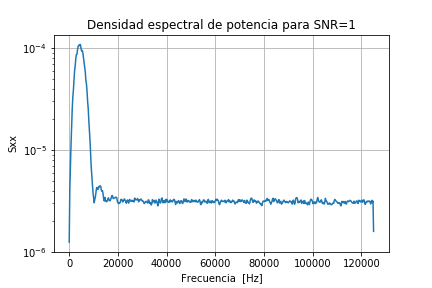
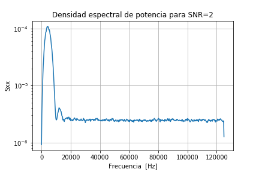
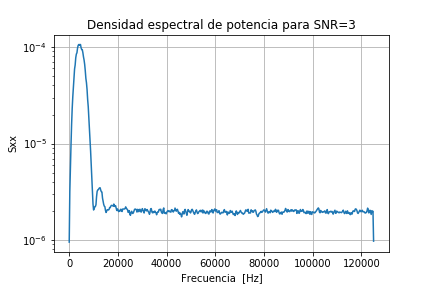
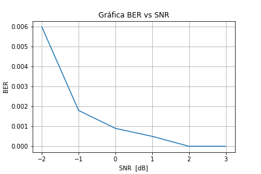

# Tarea4
## Punto 1

Se crea un esquema de modulación BPSK en python tomando los datos asignados en el enunciado de la tarea y se imprime la siguiente figura para mostrar el comportamiento de la señal de salida para los primeros bits. Además, se asignó un número de puntos de muestreo de p=50 y cada bit=1 tendrá la forma de una onda senoidal de periodo T= 50s y de igual forma cada bit=0 tendra el mismo periodo pero con la señal senoidal reflejada sobre el eje x.

## Punto 2

Se calcula la potencia promedio de la señal de salida y se obtiene el valor de aproximadamente Pprom=0.490 W,

## Punto 3

Se simula un canal ruido AWGN para una catidad de 6 valores de la relación señal-ruido de entre -2dB a 3dB incluyodos ([-2,-1,0,1,2,3]). De estos se toma el valor de SNR=0 y se grafica para dar una muestra de como sería el canal, este se muestra a continuación.

Como se puede ver de esta imagen la señal recibida aún mantiene algo de la forma de la señal de salida pero el ruido agragado la distorsiona.

## Punto 4

La siguiente figura muestra la grafica de la densidad espectral de potencia de la señal para la señal antes de pasar por el canal ruidoso

Luego, al pasar por el canal ruidoso se obtienen diferentes densidades expectrales de potencia según el SNR utilizado. Para este caso se utilizan los valores de SNR elegidos y se grafican para mostrarse en las siguientes figuras

 

De estas imágenes se puedo observar que la magnitud de Sxx va dismiyunde a medida que aumenta el SNR. Además, al comparar la densidad de potencia expectral antes de pasar por el canal ruidoso con la después de pasar por el canal, se puede ver un cambio significativo en las gráficas, ya que la primera muestra un comportamiento pulsante que va disminuyen paulatinamente, en tanto la otro aumenta a un valor máximo similar a la de antes del canal para frecuencias bajas pero disminuye inmediantamente a un valor constante.

## Punto 5

Se demodula y decodifica la señal para obtener una tasa de error de bits para cada nivel de SNR, de lo cual se obtuvo lo siguiente:
* Para un SNR=-2 se obtuvo un BER=0.0065
* Para un SNR=-1 se obtuvo un BER=0.003
* Para un SNR=0 se obtuvo un BER=0.0008
* Para un SNR=1 se obtuvo un BER=0.0007
* Para un SNR=2 se obtuvo un BER=0.0001
* Para un SNR=3 se obtuvo un BER=0.0000
Lo cual indica que hay disminución de la tasa de error de bits conforma aumenta el valor de la realación señal-ruido.

## Punto 6

Finalmente, se grafica la tasa de error de bits en función de la relación señal-ruido y se muestra a continuación.

